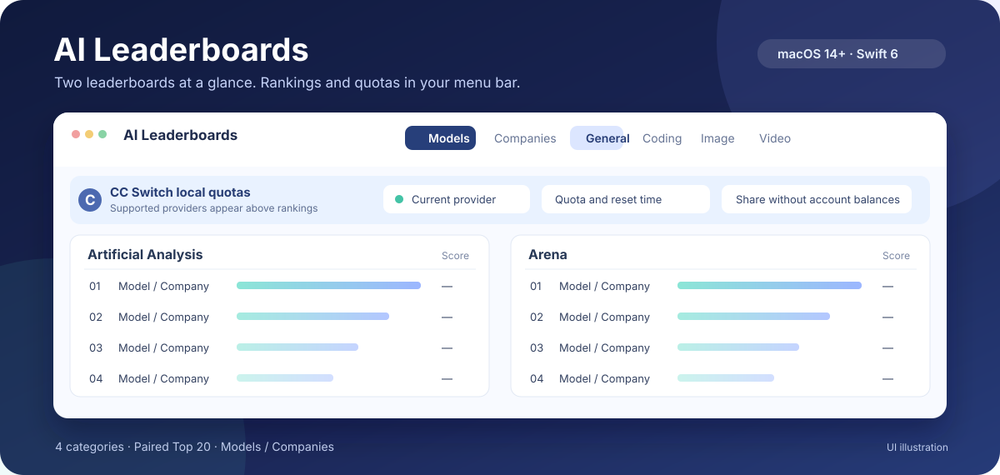

# AI Leaderboards

*Who's on top. How much you've got left.*

**English** | [简体中文](README.zh-CN.md) | [繁體中文](README.zh-TW.md)

**Compare two leaderboards at a glance. Keep model rankings and account quotas in your macOS menu bar.**

`macOS 14+` · `Swift 6` · `3 languages` · [MIT License](LICENSE)



*Interface illustration; it contains no live rankings or account data.*

Stop switching between leaderboard tabs. Open the menu bar to compare the Top 20 from Artificial Analysis and Arena side by side. If you use [CC Switch](https://github.com/farion1231/cc-switch), supported provider quotas and reset times appear above the rankings.

> If this saves you a few trips to leaderboard and quota pages, consider giving the project a **Star ⭐**.

## What you get

| Feature | What it does |
| --- | --- |
| **Paired rankings** | Compare separate Top 20 lists and scores across general, coding, image, and video categories. |
| **Models or companies** | See individual models, or rank each company by its highest-scoring listed model. Extra or weaker listings do not change that score. |
| **CC Switch quotas** | Read the local CC Switch database, query supported providers, and show account quota status above the table. Codex does not need to be installed. |
| **Plan and API links** | Available plan and pay-as-you-go links appear only in company view. Simplified Chinese prefers mainland China sites; other interface languages prefer international sites. |
| **Updates that stay out of the way** | Opening the panel checks for updates. Rankings update daily, retry hourly after a failed daily update, and remain available from the local cache when a source is temporarily down. |

### How CC Switch quotas work

The app identifies supported providers from the **local CC Switch database**, then asks their services for account quotas. Account quotas stay above the rankings; they are not model scores. With notification permission, the current provider can produce quota alerts when the alert conditions are met.

- **No CC Switch?** Rankings still work, and the quota area offers an official installation link.
- **No supported provider found?** The rankings still work without a quota strip.
- **Database read fails?** Previously loaded quota values, if any, remain visible and are marked as stale.
- **Sharing a screenshot?** The panel's copy-screenshot action replaces visible quotas with the same CC Switch setup guide shown when quotas are unavailable, keeping account balances out of the shared image.

For Qwen Token Plan, the app reads the remaining percentage and reset time from the authenticated official page. Click the Qwen quota card to sign in the first time. The official `qianwen usage summary --format json` output is a fallback when it reports a subscribed plan. CC Switch request counts from this Mac are not treated as subscription credits.

## Leaderboard sources

| Category | Left | Right |
| --- | --- | --- |
| General | Artificial Analysis Intelligence Index | Arena · Text |
| Coding | Artificial Analysis Coding Agent Index | Code Arena · WebDev |
| Image | Artificial Analysis · 文生图 (text-to-image) | Arena · 文生图 (text-to-image) |
| Video | Artificial Analysis · 文生视频 (text-to-video) | Arena · 文生视频 (text-to-video) |

Image and video use their dedicated boards. Artificial Analysis embeds a `materializedAt` stamp in its evaluation payload, so each Artificial Analysis column shows that source data time beside an index version when available. A page without the stamp falls back to the fetch time in the panel heading. Arena's vote cutoff is shown when available. Switching categories uses cached data first.

## Quick start

Running the app requires macOS 14 or later. Building from source requires Swift 6 and Command Line Tools:

```bash
./Scripts/make-app.sh
open outputs/AI-Leaderboards.app
```

The build script produces an ad-hoc signed app at `outputs/AI-Leaderboards.app`. On first launch, the interface follows the first supported macOS preferred language: English, Simplified Chinese, or Traditional Chinese. You can also switch languages in the panel footer. The selected language, category, and model/company grouping are saved locally.

## Local development

<details>
<summary>Local CI workflow</summary>

<br>

The local workflow handles purpose-based atomic commits and pushes, current-model identity and avatar, desktop notifications, and a debounced rebuild and restart. It does not run tests or code review.

```bash
./dev.sh
```

`./dev.sh` watches `Sources/`, `Package.swift`, and both `make-app.sh` scripts. It also checks for uncommitted changes and unpushed commits. After changes have stopped for one minute, and at least one minute has passed since the previous run, it commits and pushes first, then rebuilds and restarts if source files changed. On startup, existing unpushed commits are pushed immediately.

`WATCH_DEBOUNCE_MS` and `WATCH_THROTTLE_MS` change those intervals. `WATCH_AUTOCOMMIT=0` disables automatic commits; `COMMIT_PUSH=0` or `WATCH_AUTOPUSH=0` disables automatic pushes. A failed build, commit, or push is not retried repeatedly for the same source or Git state. Save again or restart `./dev.sh` to schedule another attempt.

```bash
Scripts/commit.sh                 # Stage changes and create purpose-based commits
Scripts/commit.sh --dry-run       # Print the proposed commit plan
Scripts/commit.sh --identity      # Show model name, email, and avatar
Scripts/commit.sh -m "feat(menu): …"
```

The commit author follows the current model in Codex configuration, with a vendor-specific email address. Desktop notifications try to include the model avatar and use temporary styling for success and failure. `COMMIT_SPLIT=0` creates one commit; `COMMIT_CODEX_MESSAGE=0` groups by purpose without calling a model. `Scripts/commit.sh` does not push by default. `COMMIT_COAUTHOR=1` restores the user as committer and adds a `Co-authored-by` line. `DESKTOP_NOTIFY=0` disables desktop notifications.

</details>
