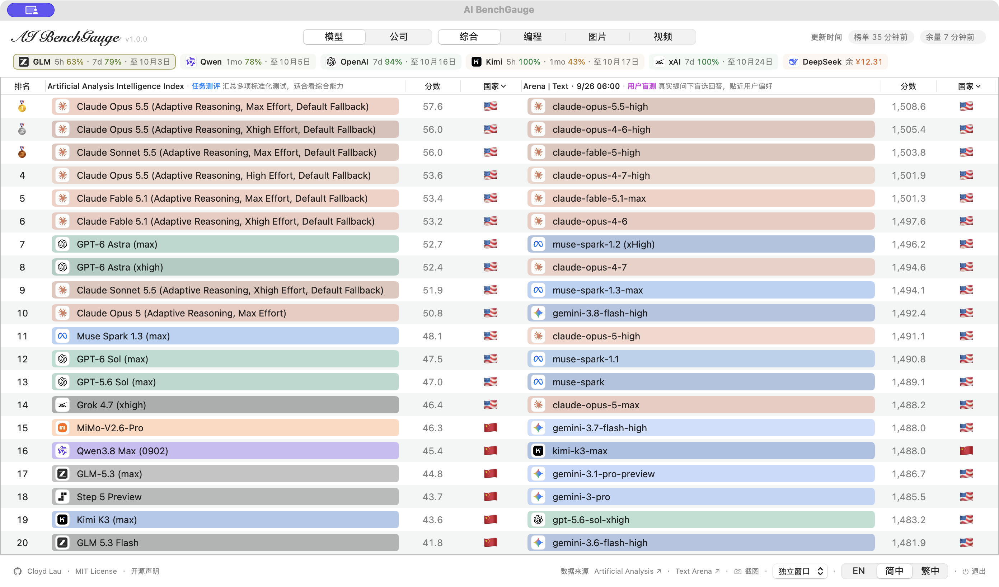
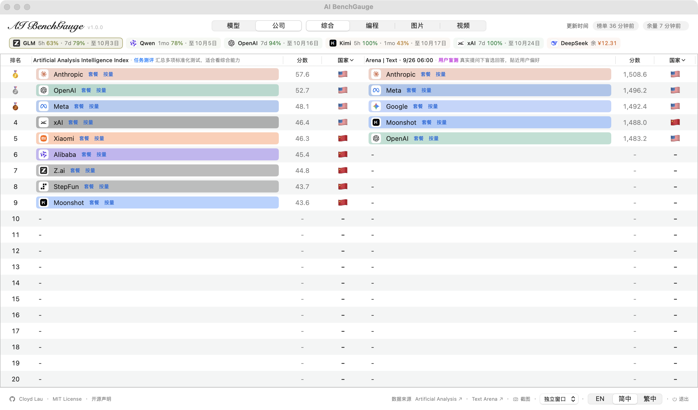

# AI BenchGauge

*AI Benchmarks & Quotas — who's on top, how much you've got left.*

**English** | [简体中文](README.zh-CN.md) | [繁體中文](README.zh-Hant.md)

**Compare two leaderboards at a glance. Keep model rankings and account quotas in your macOS menu bar or Windows tray.**

`macOS 14+` · `Windows 10/11 x64` · `Swift 6 / WPF` · `3 languages` · [MIT License](LICENSE)

<picture>
  <source media="(prefers-color-scheme: dark)" srcset="docs/screenshots/leaderboard-model-dark.png">
  
</picture>

*Real model view: two Top 20 leaderboards side by side, with the CC Switch quota strip above them.*

<picture>
  <source media="(prefers-color-scheme: dark)" srcset="docs/screenshots/leaderboard-company-dark.png">
  
</picture>

*Real company view: each organization is ranked by its strongest listed model.*

Stop switching between leaderboard tabs. Open the menu bar to compare the Top 20 from Artificial Analysis and Arena side by side. If you use [CC Switch](https://github.com/farion1231/cc-switch), supported provider quotas and reset times appear above the rankings.

> If this saves you a few trips to leaderboard and quota pages, consider giving the project a **Star ⭐**.

## System compatibility

| System | Processor | Support |
| --- | --- | --- |
| iOS 17 / iPadOS 17 or later | iPhones and iPads supported by those systems | Native project added; public TestFlight/App Store release pending |
| Windows 11 | 64-bit Intel / AMD (`x64`) | Supported |
| Windows 10 | 64-bit Intel / AMD (`x64`) | Compatibility target; .NET 10 officially supports maintained LTSC / Enterprise releases. Home / Pro editions are not yet verified. |
| Windows 7 / 8 / 8.1 | Any | Not supported |
| macOS 14 Sonoma or later | Apple silicon (`arm64`, M1 / M2 and later) | Supported |
| macOS 14 / 15 / 26, on a compatible Mac | Intel (`x86_64`) | Supported |
| macOS 13 Ventura or earlier | Any | Not supported |

The Mac `.dmg` contains one **Universal app with native Apple silicon and Intel binaries**; no Rosetta is needed.
Windows ships an `x64` `-setup.exe` with Swift and .NET included. There is no Windows 32-bit or native ARM64 package; ARM64 emulation is not verified.
See [compatibility details, validation scope, and the Intel support assessment](docs/compatibility.md).

**iPhone / iPad:** the [universal native leaderboard edition](apps/ipad/README.md) uses one app record and version. iPhone shows one board at a time with swipe/tap 3D cube switching; wide iPad layouts show both boards side by side. It supports rotation, offline cache and screenshot copying; there is no desktop display-mode selector. Newer iPadOS system windowing remains under user control. Computer account quotas are outside this edition. No public TestFlight/App Store build has been published; DMG/EXE files are for desktops.

## What you get

| Feature | What it does |
| --- | --- |
| **Paired rankings** | Compare separate Top 20 lists and scores across general, coding, image, and video categories. |
| **Models or companies** | See individual models, or rank each company by its highest-scoring listed model. Extra or weaker listings do not change that score. |
| **Four display modes** | Choose Keep open, Always on top, Close on blur, or Window from the footer menu. Keep open stays visible when you click elsewhere; click the menu bar icon again to close. Always on top also keeps the panel above other application windows. The window first opens centered on the menu bar icon's screen at the same content size as the popover. It can be moved, resized, or tiled in macOS Split View, and retains your adjustments when switching modes. |
| **CC Switch quotas** | Read the local CC Switch database, query supported providers, and show account quota status above the table. Percentage and monetary balance colors gradually change from green to red as the quota decreases. Monetary references are ¥0/10/30/100 and $0/2/5/20 for red/orange/yellow/green, with continuous transitions; hover for the currency's reference amounts. Codex does not need to be installed. |
| **Plan and API links** | Available plan and pay-as-you-go links appear only in company view. Simplified Chinese prefers mainland China sites; other interface languages prefer international sites. |
| **License notices** | Footer links open a scrollable sheet for the app's MIT license and third-party notices, with full license text available offline. See the [notice inventory](docs/third-party-notices.md) for the current audit status. |
| **Updates that stay out of the way** | Opening the panel checks for updates. Rankings update daily, retry hourly after a failed daily update, and remain available from the local cache when a source is temporarily down. |

### How CC Switch quotas work

The app identifies supported providers from the **local CC Switch database**, then asks their services for account quotas. Account quotas stay above the rankings; they are not model scores. With notification permission, the current provider can produce quota alerts when the alert conditions are met.

- **No CC Switch?** Rankings still work, and the quota area offers an official installation link.
- **No supported provider found?** The rankings still work without a quota strip.
- **Database read fails?** Previously loaded quota values, if any, remain visible and are marked as stale.
- **Sharing a screenshot?** The copy-screenshot action replaces visible quotas with the CC Switch setup guide and displays `github.com/cloydlau/ai-benchgauge` in the single-row footer, so viewers can find the project from the image.

For Qwen Token Plan, the app reads the remaining percentage and reset time from the authenticated official page. Click the Qwen quota card to sign in the first time. The official `qianwen usage summary --format json` output is a fallback when it reports a subscribed plan. CC Switch request counts from this Mac are not treated as subscription credits.

Card dates consistently say “to” for the boundary reported by the provider. The app does not infer renewal or cancellation, and a passed date alone does not mean access has expired. Hourly and weekly quota reset times appear in tooltips; a missing plan or monthly date is never replaced by a short-window reset.

Quota values and dates use independent colors on the same continuous green-to-red scale. Dates are green at 14+ days remaining, yellow at 7 days, orange at 2 days, and red at the reported boundary. The card background follows the more urgent value; a date warning does not recolor the quota text. Hover for the date color reference.

If OpenAI shows **Sign in again**, clicking the card opens the official authorization flow. Authorize the same account and the quota refreshes automatically; later queries renew the login, with reauthorization needed only if renewal fails. Direct authorization requires an installed Codex CLI or ChatGPT/Codex desktop app. Reading an existing CC Switch login still works without Codex. The new login is saved in a separate local AI BenchGauge profile and requires no manual CC Switch sync.

If xAI shows **Sign in again** or **Not signed in**, clicking the card opens CC Switch, because CC Switch owns the Grok login that this quota reads; the provider's own site has no sign-in entry. Sign in there, then reopen the panel to refresh the quota.

## Leaderboard sources

| Category | Left | Right |
| --- | --- | --- |
| General | Artificial Analysis Intelligence Index | Arena · Text |
| Coding | Artificial Analysis Coding Agent Index | Code Arena · WebDev |
| Image | Artificial Analysis · 文生图 (text-to-image) | Arena · 文生图 (text-to-image) |
| Video | Artificial Analysis · 文生视频 (text-to-video) | Arena · 文生视频 (text-to-video) |

Image and video use their dedicated boards. The Artificial Analysis Coding Agent Index embeds a `materializedAt` batch stamp in its payload, and the app shows that source data time beside the index version. The other Artificial Analysis boards expose no data timestamp, so their columns show no date and the panel heading keeps this Mac's fetch time. Arena's vote cutoff is shown when available. Switching categories uses cached data first.

Application updates use Sparkle: check for stable GitHub Releases every 24 hours, then download,
verify, install, and relaunch after the user's Install click. Click the version beside
the title to check immediately. See [release setup and signing](docs/releasing.md).

## Quick start

Download the Universal Mac `.dmg` or Windows x64 `-setup.exe` from [GitHub Releases](https://github.com/cloydlau/ai-benchgauge/releases), using the compatibility table above.
On macOS, you can also install the signed cask with Homebrew; Sparkle continues to handle in-app updates:

```bash
brew tap cloydlau/ai-benchgauge https://github.com/cloydlau/ai-benchgauge
brew install --cask ai-benchgauge
```

Mac source builds require Swift 6, Command Line Tools and .NET 10 SDK for the Windows update tests:

```bash
./Scripts/make-app.sh
open outputs/AI-BenchGauge.app
```

Local builds target the current Mac's architecture by default. Use `APP_UNIVERSAL=1 ./make-app.sh` to build for both Apple silicon and Intel; CI and Release use this option.

The build script produces an ad-hoc signed app at `outputs/AI-BenchGauge.app`. On first launch, the interface follows the first supported macOS preferred language: English, Simplified Chinese, or Traditional Chinese. You can also switch languages in the panel footer. The selected language, category, and model/company grouping are saved locally.

## Local development

<details>
<summary>Calmmit workflow</summary>

<br>

The local workflow reads [calmmit.config.json](calmmit.config.json) and executes the live source at `../calmmit`; `CALMMIT_PATH` can select another checkout. Feature switches stay in this repository. No npm publication is required. See [Calmmit integration](docs/CALMMIT.md) for local commands and the two GitHub Actions repository variables.

The local workflow runs the Swift, Node.js and Windows update test suites before purpose-based atomic commits, pushes, builds, and restarts. It also handles current-model identity, avatars, desktop notifications, debounce, and throttle.

```bash
MODEL_NAME=actual-model ./dev.sh
```

`./dev.sh` runs tests on startup, then reopens the latest app, building first if the executable is missing or older than the source. The debounce and throttle intervals below apply to subsequent changes. A test failure stops subsequent actions; the watcher stays active and retries after a new save.

`./dev.sh` watches `Sources/`, `apps/`, `assets/`, `config/`, `Tests/`, `Scripts/`, and the root build/development scripts. It also checks for uncommitted changes and unpushed commits. After changes have stopped for one minute, and at least one minute has passed since the previous run, it runs tests, commits and pushes, then rebuilds and restarts when watched files changed. Existing unpushed commits also require passing tests. Child commit/build processes reuse a pass only while all test inputs remain identical.

`WATCH_DEBOUNCE_MS` and `WATCH_THROTTLE_MS` change those intervals. `WATCH_AUTOCOMMIT=0` disables automatic commits; `COMMIT_PUSH=0` or `WATCH_AUTOPUSH=0` disables automatic pushes. A failed build, commit, or push is not retried repeatedly for the same source or Git state. Save again or restart `./dev.sh` to schedule another attempt.

```bash
./test.sh                         # Complete offline tests
./test.sh --core                  # Swift core only
./test.sh --scripts               # Scripts and Windows update tests
./test.sh --coverage              # Swift and Node.js coverage
DESKTOP_NOTIFY=0 node Scripts/ci-checks.mjs  # Syntax, tests, release app build
```

Standalone `Scripts/commit.sh` and `./make-app.sh` also require passing tests. On a gate failure, Codex may attempt one source repair, followed by the complete real test suite; an AI report cannot bypass tests. Incomplete reports, unresolved decisions, changed test/config files, and repeated failures stop the workflow. `TEST_AUTO_REPAIR=0` disables repair; `TEST_REPAIR_CODEX` selects the CLI and `TEST_REPAIR_TIMEOUT_MS` changes the default 10-minute limit. Offline sandboxes and known environment failures skip AI repair. Logs and repair state remain in ignored `work/test-results/`; a restart does not reset the repair budget for identical code. Manual `./test.sh` only runs tests.

See [Testing](docs/testing.md) for test scope and optional saved-page fixtures. Restart an already running `./dev.sh` once after updating workflow scripts.

```bash
MODEL_NAME=actual-model Scripts/commit.sh                 # Stage changes and create purpose-based commits
MODEL_NAME=actual-model Scripts/commit.sh --dry-run       # Print the proposed commit plan
MODEL_NAME=actual-model Scripts/commit.sh --identity      # Show model name and email
MODEL_NAME=actual-model Scripts/commit.sh -m "feat(menu): …"
```

Set `MODEL_NAME` to the model actually doing the work. Both author and committer use that model; the global Codex default is not used to guess the identity. `COMMIT_SPLIT=0` creates one commit; `COMMIT_CODEX_MESSAGE=0` uses one locally generated commit message. Standalone commits do not push by default. `DESKTOP_NOTIFY=0` disables notifications.

All added or changed bitmaps and recordings pass the shared independent AI privacy and intent gate. Declare exact output paths and their purpose in the ignored `.media-review.local.json` before creating media. Approval binds to the exact Git blobs and declared intent; changed content or purpose requires another review. The repository owner may explicitly grant a manual exception with `COMMIT_MEDIA_REVIEWED=1` after reviewing the full media. Deletions are unrestricted. `node Scripts/media-gate-ci.mjs <base> <head>` rechecks the complete pushed range, including newly introduced media in merges.

</details>

## Windows and platform layout

Windows uses a native WPF tray/window client and the same Swift business logic as macOS.
Download the `.dmg` (Apple silicon + Intel) or Windows x64 `-setup.exe` from the same [GitHub Release](https://github.com/cloydlau/ai-benchgauge/releases).
Both apps share versions, quota rules and signed update checks every 24 hours. Windows includes Swift/.NET runtimes and supports Qwen sign-in through WebView2.
See [Windows build instructions](apps/windows/README.md), [project structure](docs/architecture.md) and [release setup](docs/releasing.md).
Local full tests now require .NET 10 SDK; `BENCHGAUGE_DOTNET` can select its executable.
