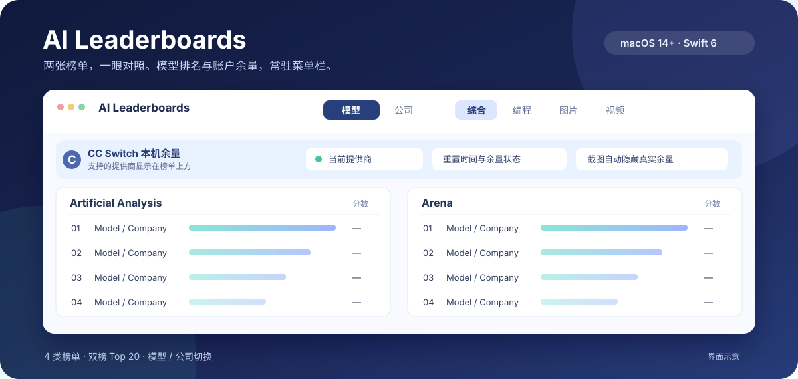

# AI Leaderboards

[English](README.md) | **简体中文** | [繁體中文](README.zh-TW.md)

**两张榜单，一眼对照。模型排名与账户余量，常驻 macOS 菜单栏。**

`macOS 14+` · `Swift 6` · `English / 简中 / 繁中` · [MIT 许可证](LICENSE)



*界面示意图，不展示真实排名或账户余量。*

不用在多个榜单网页之间来回切换：打开菜单栏，就能并排查看 Artificial Analysis 与 Arena 的 Top 20。装有 [CC Switch](https://github.com/farion1231/cc-switch) 时，还能在榜单上方查看支持的提供商余量和重置时间。

> 如果它帮你省下了反复查榜单、查余量的时间，欢迎点右上角 **Star ⭐**。

## 你会得到什么

| 功能 | 用起来是什么样 |
| --- | --- |
| **双榜对照** | 综合、编程、图片、视频四类榜单，每类并排展示两个来源的 Top 20 与各自分数。 |
| **模型 / 公司切换** | 模型看具体型号；公司以该公司上榜模型的最高分排名，不会因为多上榜或较弱型号而改变分数。 |
| **CC Switch 余量** | 读取本机 CC Switch 数据，查询支持的提供商余量，并在榜单上方显示状态；无需安装 Codex。 |
| **直达套餐与按量页面** | 仅在“公司”分组显示可用的“套餐 / 按量”链接。简中优先打开中国大陆站点，其他界面语言优先打开国际站点。 |
| **少打扰的更新** | 点开菜单栏时检查更新；榜单每天自动更新，失败后按小时重试。缓存让来源暂时不可用时仍能查看上次结果。 |

### CC Switch 余量如何工作？

应用从**本机 CC Switch 数据库**识别支持的提供商，再查询相应服务的账户余量。余量属于账户信息，不会混进模型分数列。当前使用的提供商在满足提醒条件、且你允许通知时，可收到余量提醒。

- 没有 CC Switch：榜单照常可用，余量区域提供官方安装入口。
- 没找到支持的提供商：不显示余量条，榜单照常可用。
- 数据库暂时读取失败：如果有上次的余量数据，就保留并标记为旧数据。
- 复制弹窗截图：自动把可见余量替换成 CC Switch 引导，避免把真实账户数据分享出去。

千问 Token Plan 的剩余比例与重置时间来自登录后的官方页面；首次使用可点击千问余量卡片登录。官方 `qianwen usage summary --format json` 在返回已订阅套餐时作为备用来源。CC Switch 记录的本机请求次数不等于订阅剩余额度，因此不会冒充 Token Plan 余量。

## 榜单来源

| 分类 | 左侧 | 右侧 |
| --- | --- | --- |
| 综合 | Artificial Analysis Intelligence Index | Arena · Text |
| 编程 | Artificial Analysis Coding Agent Index | Code Arena · WebDev |
| 图片 | Artificial Analysis · 文生图 | Arena · 文生图 |
| 视频 | Artificial Analysis · 文生视频 | Arena · 文生视频 |

图片和视频使用对应的专项榜单。Artificial Analysis 的评测数据里带有批次生成时间 `materializedAt`，可用时会在对应列标题上显示这个源站数据时间和版本号；页面没有该字段时，面板顶部仍显示本机抓取时间。Arena 有投票截止时间时会显示该时间。切换分类会优先读取缓存，不必每次重新等待网络。

## 快速开始

运行需要 macOS 14 或更新版本。源码构建需要 Swift 6 和 Command Line Tools：

```bash
./Scripts/make-app.sh
open outputs/AI-Leaderboards.app
```

脚本会生成临时签名的 `outputs/AI-Leaderboards.app`。首次启动按 macOS 首选语言选择英文、简体中文或繁体中文；也可以在弹窗底部切换。分类、模型 / 公司分组和语言选择会保存在本机。

## 本地开发

<details>
<summary>展开本地 CI 说明</summary>

<br>

本地流程只做四件事：按目的拆分提交并推送、识别当前模型名称和头像、桌面通知、改完代码后防抖节流自动重启。不跑测试，也不做 code review。

```bash
./dev.sh
```

`./dev.sh` 监听 `Sources/`、`Package.swift` 和两个 `make-app.sh`，同时检查 git 里还有没有未提交改动和未推送提交。变更停止 1 分钟，并且距上次运行至少 1 分钟后，先按目的拆成原子提交并推送到上游，再在源码有变化时重建并重启。启动时如果只有未推送提交，会立刻推送。

`WATCH_DEBOUNCE_MS` 和 `WATCH_THROTTLE_MS` 可改这两个间隔，`WATCH_AUTOCOMMIT=0` 关闭自动提交，`COMMIT_PUSH=0` 或 `WATCH_AUTOPUSH=0` 关闭自动推送。构建失败后，同一份源码签名不会空转重试；提交失败后，同一份 git 状态也不会空转重试；推送失败后，同一提交也不会空转重试。再保存一次，或重启 `./dev.sh`，才会重新调度。

```bash
Scripts/commit.sh                 # 立刻暂存全部改动并拆成原子提交
Scripts/commit.sh --dry-run       # 只打印拆分计划
Scripts/commit.sh --identity      # 查看模型名称、邮箱和头像
Scripts/commit.sh -m "feat(menu): …"
```

作者是 Codex 配置里的当前模型，邮箱按厂商填写，桌面通知会尽量带上模型图标。成功和失败通知都使用临时样式。`COMMIT_SPLIT=0` 合并成一个提交。`COMMIT_CODEX_MESSAGE=0` 不调用模型，按用途分组。`Scripts/commit.sh` 的 `COMMIT_PUSH` 仍默认关闭。`COMMIT_COAUTHOR=1` 才把本人恢复为 committer，并加上 `Co-authored-by`。`DESKTOP_NOTIFY=0` 关闭桌面通知。

</details>
