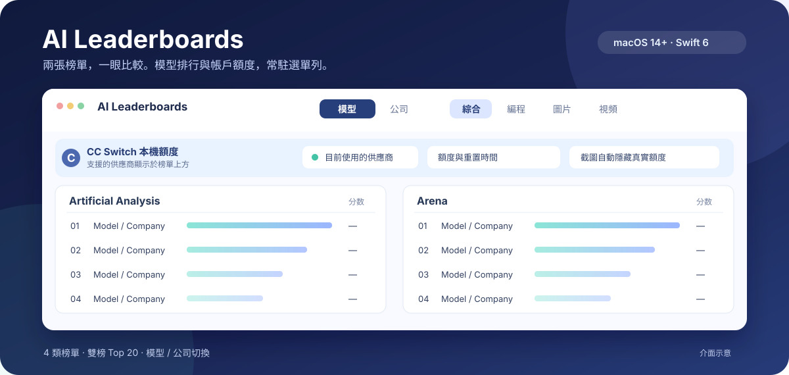

# AI BenchGauge

*Who's on top. How much you've got left.*

[English](README.md) | [简体中文](README.zh-CN.md) | **繁體中文**

**兩張榜單，一眼比較。模型排行與帳戶額度，常駐 macOS 選單列。**

`macOS 14+` · `Swift 6` · `English / 簡中 / 繁中` · [MIT 授權條款](LICENSE)



*介面示意圖，不顯示真實排名或帳戶額度。*

不用在多個排行榜網頁之間來回切換：打開選單列，就能並排查看 Artificial Analysis 與 Arena 的 Top 20。若已安裝 [CC Switch](https://github.com/farion1231/cc-switch)，還能在榜單上方查看支援的供應商額度與重置時間。

> 如果它幫你省下反覆查榜單、查額度的時間，歡迎點擊右上角的 **Star ⭐**。

## 你會得到什麼

| 功能 | 使用時會看到什麼 |
| --- | --- |
| **雙榜比較** | 綜合、編程、圖片、視頻四類榜單，每類並排顯示兩個來源的 Top 20 與各自分數。 |
| **模型 / 公司切換** | 模型檢視具體型號；公司以該公司上榜模型的最高分排名，不會因為多個上榜型號或較弱型號而改變分數。 |
| **CC Switch 額度** | 讀取本機 CC Switch 資料，查詢支援的供應商額度，並在榜單上方顯示狀態；不必安裝 Codex。 |
| **直達套餐與按量頁面** | 僅在「公司」分組顯示可用的「套餐 / 按量」連結。簡體中文優先開啟中國大陸站點，其他介面語言優先開啟國際站點。 |
| **不打擾的更新** | 打開選單列時檢查更新；榜單每天自動更新，失敗後每小時重試。來源暫時無法使用時，仍可查看本機快取。 |

### CC Switch 額度如何運作？

應用程式從**本機 CC Switch 資料庫**識別支援的供應商，再向相應服務查詢帳戶額度。額度屬於帳戶資訊，不會混入模型分數欄。當目前使用的供應商符合提醒條件，且你允許通知時，應用程式可以發送額度提醒。

- 沒有 CC Switch：榜單照常可用，額度區域提供官方安裝連結。
- 找不到支援的供應商：不顯示額度列，榜單照常可用。
- 資料庫暫時讀取失敗：如果有上次的額度資料，就保留並標示為舊資料。
- 複製彈出視窗截圖：自動以 CC Switch 安裝引導取代可見額度，避免分享真實帳戶資料。

千問 Token Plan 的剩餘比例與重置時間來自登入後的官方頁面；首次使用可點擊千問額度卡片登入。官方 `qianwen usage summary --format json` 在回傳已訂閱方案時作為備用來源。CC Switch 記錄的本機請求次數不等於訂閱剩餘額度，因此不會被當作 Token Plan 額度。

## 榜單來源

| 分類 | 左側 | 右側 |
| --- | --- | --- |
| 綜合 | Artificial Analysis Intelligence Index | Arena · Text |
| 編程 | Artificial Analysis Coding Agent Index | Code Arena · WebDev |
| 圖片 | Artificial Analysis · 文生圖 | Arena · 文生圖 |
| 視頻 | Artificial Analysis · 文生視頻 | Arena · 文生視頻 |

圖片和視頻使用對應的專項榜單。Artificial Analysis 只有編程智能體榜的資料帶有批次產生時間 `materializedAt`，應用程式會在該欄位標題顯示這個來源資料時間與版本號；綜合、文生圖、文生視頻三塊沒有公開資料時間，欄位標題不顯示日期，面板上方仍顯示本機擷取時間。Arena 提供投票截止時間時則會顯示該時間。切換分類會優先讀取快取，不必每次都等待網路。

## 快速開始

執行需要 macOS 14 或更新版本。從原始碼建置需要 Swift 6 和 Command Line Tools：

```bash
./Scripts/make-app.sh
open outputs/AI-BenchGauge.app
```

腳本會產生臨時簽署的 `outputs/AI-BenchGauge.app`。首次啟動時，介面會依照 macOS 偏好的語言選擇英文、簡體中文或繁體中文；你也可以在彈出視窗底部切換。分類、模型 / 公司分組與語言選擇會儲存在本機。

## 本機開發

<details>
<summary>展開本機 CI 說明</summary>

<br>

本機流程處理四件事：依用途拆分提交並推送、識別目前模型的名稱與頭像、桌面通知，以及程式碼變更後經過防抖與節流再自動重新建置並重啟。不執行測試，也不做程式碼審查。

```bash
./dev.sh
```

`./dev.sh` 監看 `Sources/`、`Package.swift` 與兩個 `make-app.sh`，同時檢查 Git 是否有未提交的變更或未推送的提交。變更停止一分鐘，且距離上次執行至少一分鐘後，會先依用途建立原子提交並推送；若原始碼有變更，再重新建置並重啟。啟動時若只有未推送的提交，會立即推送。

`WATCH_DEBOUNCE_MS` 與 `WATCH_THROTTLE_MS` 可調整這兩段間隔。`WATCH_AUTOCOMMIT=0` 關閉自動提交；`COMMIT_PUSH=0` 或 `WATCH_AUTOPUSH=0` 關閉自動推送。建置、提交或推送失敗後，相同的原始碼或 Git 狀態不會無限重試。再次儲存檔案或重啟 `./dev.sh`，才會重新排程。

```bash
Scripts/commit.sh                 # 立即暫存全部變更並依用途拆分提交
Scripts/commit.sh --dry-run       # 僅列印提交計畫
Scripts/commit.sh --identity      # 查看模型名稱、電子郵件與頭像
Scripts/commit.sh -m "feat(menu): …"
```

提交作者採用 Codex 設定中的目前模型，電子郵件依供應商設定。桌面通知會盡量附上模型頭像，成功與失敗通知都使用暫時顯示的樣式。`COMMIT_SPLIT=0` 將變更合併為單一提交；`COMMIT_CODEX_MESSAGE=0` 不呼叫模型，而是依用途分組。`Scripts/commit.sh` 的 `COMMIT_PUSH` 預設仍為關閉。`COMMIT_COAUTHOR=1` 才會將使用者恢復為 committer，並加入 `Co-authored-by`。`DESKTOP_NOTIFY=0` 關閉桌面通知。

</details>
