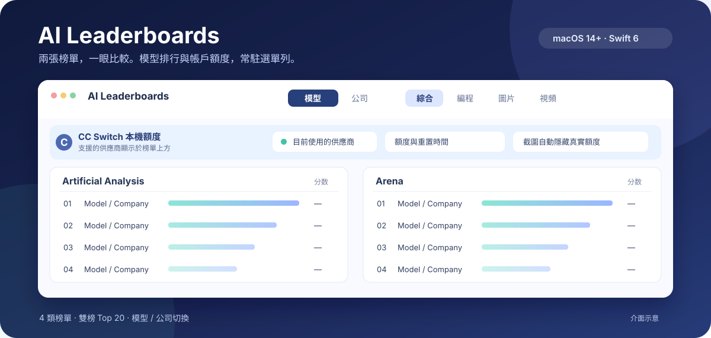

# AI BenchGauge

*AI Benchmarks & Quotas — who's on top, how much you've got left.*

[English](README.md) | [简体中文](README.zh-CN.md) | **繁體中文**

**兩張榜單，一眼比較。模型排行與帳戶額度，常駐 macOS 選單列。**

`macOS 14+` · `Windows 10/11 x64` · `Swift 6 / WPF` · `English / 簡中 / 繁中` · [MIT 授權條款](LICENSE)



*介面示意圖，不顯示真實排名或帳戶額度。*

不用在多個排行榜網頁之間來回切換：打開選單列，就能並排查看 Artificial Analysis 與 Arena 的 Top 20。若已安裝 [CC Switch](https://github.com/farion1231/cc-switch)，還能在榜單上方查看支援的供應商額度與重置時間。

> 如果它幫你省下反覆查榜單、查額度的時間，歡迎點擊右上角的 **Star ⭐**。

## 你會得到什麼

| 功能 | 使用時會看到什麼 |
| --- | --- |
| **雙榜比較** | 綜合、編程、圖片、視頻四類榜單，每類並排顯示兩個來源的 Top 20 與各自分數。 |
| **模型 / 公司切換** | 模型檢視具體型號；公司以該公司上榜模型的最高分排名，不會因為多個上榜型號或較弱型號而改變分數。 |
| **四種顯示模式** | 底部下拉選單可選「保持打開」「保持置頂」「失焦關閉」「獨立視窗」；「保持打開」點擊其他位置不會關閉，再點選單列圖示關閉。「保持置頂」還會讓彈窗顯示在其他應用程式視窗之上。獨立視窗首次打開時在選單列圖示所在螢幕置中，內容寬高與彈窗一致；可拖動、調整大小和 macOS 分割顯示，切換模式時保留手動調整的位置和大小。 |
| **CC Switch 額度** | 讀取本機 CC Switch 資料，查詢支援的供應商額度，並在榜單上方顯示狀態；百分比和金額顏色隨剩餘額度減少從綠色漸變至紅色。金額以 ¥0/10/30/100、$0/2/5/20 分別對應紅/橙/黃/綠，中間連續過渡，懸停可查看各幣別的參照金額；不必安裝 Codex。 |
| **直達套餐與按量頁面** | 僅在「公司」分組顯示可用的「套餐 / 按量」連結。簡體中文優先開啟中國大陸站點，其他介面語言優先開啟國際站點。 |
| **許可證與聲明** | 左下角 MIT License 與右下角「開源聲明」打開同一個可捲動彈窗，完整許可正文可離線查看。目前核對情況見[聲明清單](docs/third-party-notices.md)。 |
| **不打擾的更新** | 打開選單列時檢查更新；榜單每天自動更新，失敗後每小時重試。來源暫時無法使用時，仍可查看本機快取。 |

### CC Switch 額度如何運作？

應用程式從**本機 CC Switch 資料庫**識別支援的供應商，再向相應服務查詢帳戶額度。額度屬於帳戶資訊，不會混入模型分數欄。當目前使用的供應商符合提醒條件，且你允許通知時，應用程式可以發送額度提醒。

- 沒有 CC Switch：榜單照常可用，額度區域提供官方安裝連結。
- 找不到支援的供應商：不顯示額度列，榜單照常可用。
- 資料庫暫時讀取失敗：如果有上次的額度資料，就保留並標示為舊資料。
- 複製應用截圖：自動以 CC Switch 安裝引導取代可見額度，並在單行頁尾直接顯示 `github.com/cloydlau/ai-benchgauge`，方便看到圖片的人找到專案。

千問 Token Plan 的剩餘比例與重置時間來自登入後的官方頁面；首次使用可點擊千問額度卡片登入。官方 `qianwen usage summary --format json` 在回傳已訂閱方案時作為備用來源。CC Switch 記錄的本機請求次數不等於訂閱剩餘額度，因此不會被當作 Token Plan 額度。

卡片日期統一顯示「至」，表示介面提供的本期邊界；目前不判斷續訂或取消續訂，也不會僅因日期已過就認定方案已到期。小時和週度額度重置時間可在提示中查看；缺少方案或月度日期時，不會用短週期重置時間替代。

OpenAI 顯示「需要重新登入」時，點擊卡片會直接開啟官方授權頁。同一帳號完成授權後，卡片自動更新；後續查詢會自動續期，只有續期失敗才需要再次授權。直接授權需要本機安裝 Codex CLI 或 ChatGPT/Codex 桌面應用；已有 CC Switch 登入的額度查詢仍無需安裝 Codex。新授權儲存在 AI BenchGauge 的獨立本機設定中，不需要手動同步 CC Switch。

## 榜單來源

| 分類 | 左側 | 右側 |
| --- | --- | --- |
| 綜合 | Artificial Analysis Intelligence Index | Arena · Text |
| 編程 | Artificial Analysis Coding Agent Index | Code Arena · WebDev |
| 圖片 | Artificial Analysis · 文生圖 | Arena · 文生圖 |
| 視頻 | Artificial Analysis · 文生視頻 | Arena · 文生視頻 |

圖片和視頻使用對應的專項榜單。Artificial Analysis 只有編程智能體榜的資料帶有批次產生時間 `materializedAt`，應用程式會在該欄位標題顯示這個來源資料時間與版本號；綜合、文生圖、文生視頻三塊沒有公開資料時間，欄位標題不顯示日期，面板上方仍顯示本機擷取時間。Arena 提供投票截止時間時則會顯示該時間。切換分類會優先讀取快取，不必每次都等待網路。

應用每小時檢查 GitHub 穩定版，發現新版後提示安裝；點擊後下載、驗證簽章、
更新並重新啟動。點擊標題旁的版本號可立即檢查。[發版設定](docs/releasing.md)。

## 快速開始

Mac 版執行需要 macOS 14 或更新版本。Mac 原始碼建置需要 Swift 6、Command Line Tools 與 .NET 10 SDK（執行 Windows 更新測試）：

```bash
./Scripts/make-app.sh
open outputs/AI-BenchGauge.app
```

腳本會產生臨時簽署的 `outputs/AI-BenchGauge.app`。首次啟動時，介面會依照 macOS 偏好的語言選擇英文、簡體中文或繁體中文；你也可以在彈出視窗底部切換。分類、模型 / 公司分組與語言選擇會儲存在本機。

## 本機開發

<details>
<summary>展開本機 CI 說明</summary>

<br>

本機流程先執行完整的 Swift 核心、Node.js 腳本與 Windows 更新測試，通過後再依用途提交、推送、建置及重啟，同時保留模型署名、頭像、桌面通知及防抖節流。

```bash
./dev.sh
```

`./dev.sh` 啟動時先執行測試，再重新開啟最新應用；如果執行檔缺失或原始碼較新，會先建置再啟動。後續儲存依照下列防抖與節流間隔處理。測試失敗會阻擋後續動作，監看程式持續等待，儲存修復後重新驗證。

`./dev.sh` 監看 `Sources/`、`apps/`、`assets/`、`config/`、`Tests/`、`Scripts/` 與根目錄的建置、開發腳本，同時檢查未提交變更與未推送提交。變更停止一分鐘，且距離上次執行至少一分鐘後，先測試，再提交及推送，監看檔案有變更時重新建置重啟。既有的未推送提交也必須先通過測試。子提交、建置程序只在測試輸入完全相同時沿用本次通過的結果。

`WATCH_DEBOUNCE_MS` 與 `WATCH_THROTTLE_MS` 可調整這兩段間隔。`WATCH_AUTOCOMMIT=0` 關閉自動提交；`COMMIT_PUSH=0` 或 `WATCH_AUTOPUSH=0` 關閉自動推送。建置、提交或推送失敗後，相同的原始碼或 Git 狀態不會無限重試。再次儲存檔案或重啟 `./dev.sh`，才會重新排程。

```bash
./test.sh                         # 完整離線測試
./test.sh --core                  # 僅 Swift 核心
./test.sh --scripts               # 腳本與 Windows 更新測試
./test.sh --coverage              # Swift 與 Node.js 覆蓋率
DESKTOP_NOTIFY=0 node Scripts/ci-checks.mjs  # 語法、測試、正式應用建置
```

單獨執行 `Scripts/commit.sh` 或 `./make-app.sh` 也必須先通過測試。檢查失敗後，Codex 最多嘗試一次原始碼修復，再執行完整真實測試；模型報告不能取代驗證。報告不完整、有待決策項、修改測試或流程設定、複驗仍失敗都會停止後續流程。`TEST_AUTO_REPAIR=0` 關閉修復；`TEST_REPAIR_CODEX` 指定 CLI，`TEST_REPAIR_TIMEOUT_MS` 調整預設 10 分鐘的上限。禁網沙箱與已識別的環境問題不會呼叫 AI 修復。日誌與修復狀態保存在忽略的 `work/test-results/`，重啟不會重設同一份程式碼的修復預算。手動 `./test.sh` 只執行測試。

測試範圍與可選網頁快照請見 [測試說明](docs/testing.md)。更新流程腳本後，已執行的 `./dev.sh` 需要重啟一次。

```bash
Scripts/commit.sh                 # 立即暫存全部變更並依用途拆分提交
Scripts/commit.sh --dry-run       # 僅列印提交計畫
Scripts/commit.sh --identity      # 查看模型名稱、電子郵件與頭像
Scripts/commit.sh -m "feat(menu): …"
```

提交作者採用 Codex 設定中的目前模型，電子郵件依供應商設定。桌面通知會盡量附上模型頭像，成功與失敗通知都使用暫時顯示的樣式。`COMMIT_SPLIT=0` 將變更合併為單一提交；`COMMIT_CODEX_MESSAGE=0` 不呼叫模型，而是依用途分組。`Scripts/commit.sh` 的 `COMMIT_PUSH` 預設仍為關閉。`COMMIT_COAUTHOR=1` 才會將使用者恢復為 committer，並加入 `Co-authored-by`。`DESKTOP_NOTIFY=0` 關閉桌面通知。

</details>

## Windows 與平台結構

Mac 與 Windows 共用 Swift 業務邏輯與版本號。每次 [GitHub Release](https://github.com/cloydlau/ai-benchgauge/releases)
同時提供 Mac 通用 `.dmg` 與 Windows x64 `-setup.exe`，兩端每小時檢查簽名更新。
Windows 安裝包包含 Swift / .NET 執行環境，千問登入使用 WebView2。
詳見 [Windows 建置](apps/windows/README.md)、[目錄結構](docs/architecture.md)及[發版設定](docs/releasing.md)。
完整本機測試另需 .NET 10 SDK；可用 `BENCHGAUGE_DOTNET` 指定執行檔。
