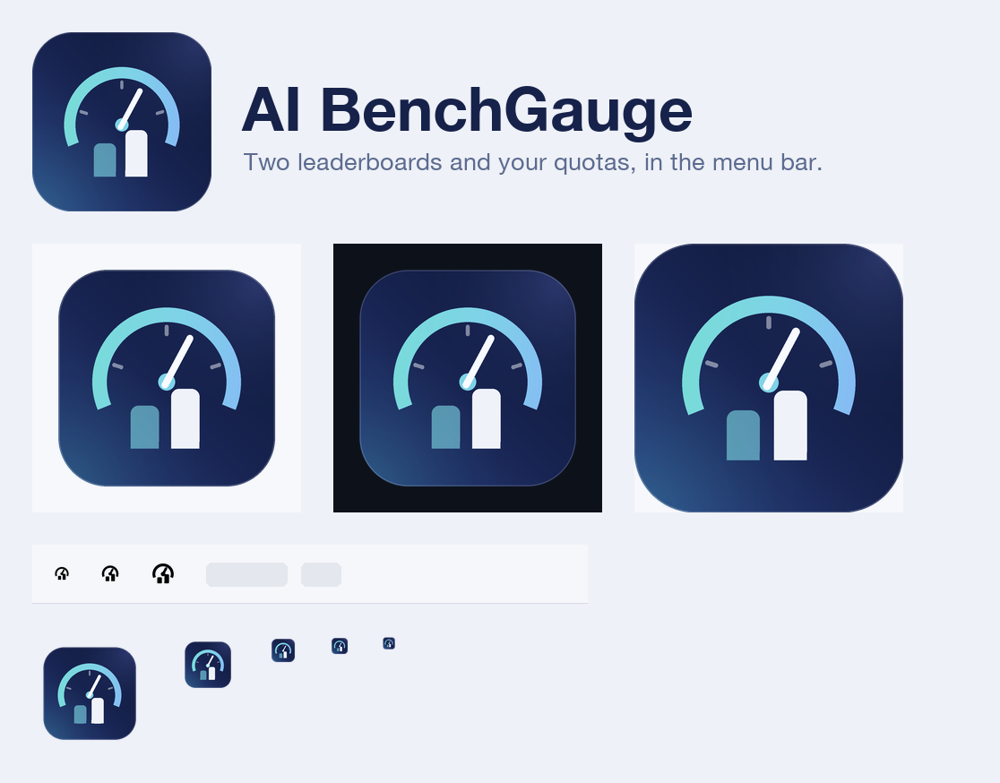

# AI BenchGauge logo

Concept: a gauge dial with a needle ("Gauge") framing two ranking bars — the paired
leaderboards ("Bench"). The leading bar is ink white, the second board is the accent
gradient at reduced alpha.



## Assets

| File | Use |
| --- | --- |
| `ai-benchgauge-icon.svg`, `ai-benchgauge-icon-1024.png`, `ai-benchgauge-icon-512.png` | macOS app icon (1024 grid, 824 body, corner radius 0.225) |
| `AI-BenchGauge.icns` | App icon container, 16-1024 px |
| `ai-benchgauge-mark.svg`, `ai-benchgauge-mark-512.png` | Full-bleed squircle mark: avatar, favicon, social |
| `ai-benchgauge-lockup.svg`, `ai-benchgauge-lockup.png` | Horizontal lockup with wordmark (README, docs) |
| `ai-benchgauge-menubar-template.svg`, `ai-benchgauge-menubar-22.png`, `ai-benchgauge-menubar-22@2x.png` | Monochrome template glyph for the menu bar |
| `preview.png` | Overview sheet |
| `src/` | Generator scripts |

## Palette

- Tile gradient: `#0d1734` -> `#182451` -> `#2b4686` (matches the README backdrop)
- Accent gradient: `#74e2cd` -> `#7fd3e8` -> `#8ba9ff`
- Ink: `#f7faff`

## Regenerate

```bash
cd docs/logo/src
python3 export_assets.py   # SVG + PNG + icns + preview.png into docs/logo
python3 verify_svg.py      # rasterizes exported SVGs and diffs geometry vs the Pillow render
```

Requires Pillow. The `.icns` container is written directly because `iconutil` is not
available in every sandbox. The app itself does not reference these assets yet: the menu
bar still uses the SF Symbol `brain.head.profile`, and the bundle has no icon file.
